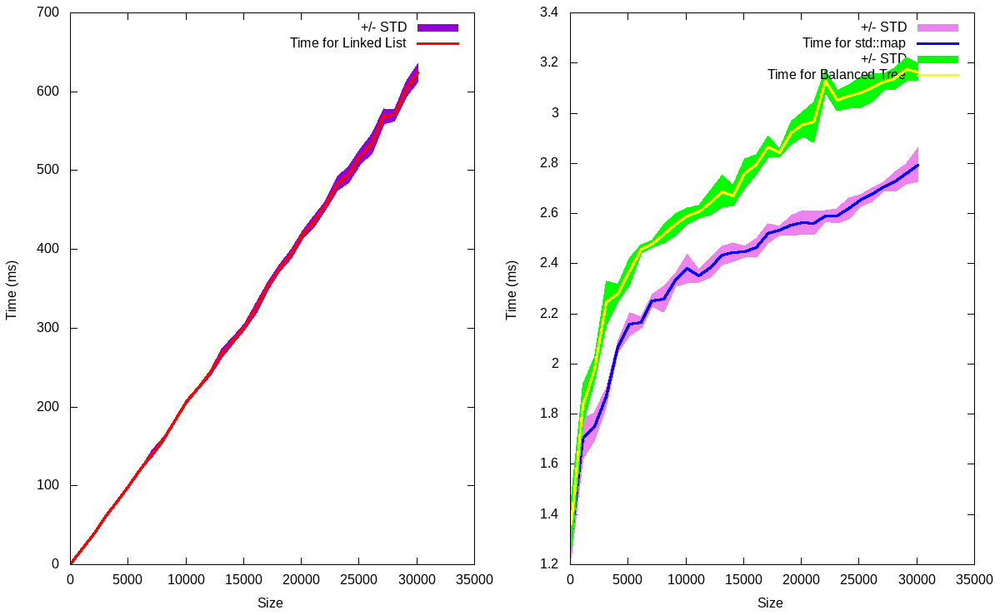

# C++ Exam: Binary Tree

### Jesus Espinoza and Federico Barone

--------------------------------


For this exercise we were asked to implement a binary tree class.

`Main.cpp` contains the implementation of the class as well as a few simple tests to check the different methods of the class and a benchmark of its performance (how the find method performs).

Full `doxygen` documentation of the code is available in the documentation folder. (Check `index.html`).

Running either the tests or the benchmark can be done through the ``Makefile`` . To run the test execute the following command:

```shell
$ make test
```

To run the benchmark and plot the results execute the following commands:

```shell
$ make benchmark
$ make plot
```

 In order to check for memory leaks with ``valgrind``, run:

```shell
$ make debug
```

Finally, In order to clean up the directory from binaries,  generated benchmark data and images, run:

```shell
$ make clean
```

Figure 1 shows the results of the benchmark. We compared the performance of the following data structures:

*  A linked list (actually it is our binary tree with nodes inserted in ascending order).
* A balanced binary tree (the result of applying the the function ``balance()`` to the previous structure). 
* A std::map from the standard library.



The figure shows the search times for the 3 structures, depending on the number of nodes (The number of nodes is varied from 100 to 30000).  All structures contain the same data nodes and all look for the same random keys (the wall time is used as the seed of random numbers, so the keys to search are always different in each run). To reduce the statistical errors associated with time fluctuations, two levels of repetitions are used: a first series within the program that adds up the required search times for a set of common keys for the three structures inside a for-loop, and a second series of repetitions made by a bash script ``runner.sh`` that repeats the measurements of the previous times for different sizes of the structures. The appropriate calculations of averages and standard deviations are carried out by that same script.

 As can be seen, the search times of the linked list are considerably higher, exhibiting a linear behavior with the number of nodes, as expected for a linked list (complexity n). Both the balanced binary tree and std::map show a logarithmic behavior, which goes in accordance with the their expected complexities (log n),  clearly std::map has a better performance, due to its high level of optimizations.

 Lastly, some comments about the implementation of two important functions of the class: `insert()` and `find()`.

The core of both functions is another function, `pos_find(TK& key)`, which works as follows. It takes a key as an argument and returns a pointer to the node which matches that key. If the key is not present in the `BinaryTree` then it returns a pointer to the node directly above this missing key. By doing this, it simplifies the implementation of ``insert()`` and ``find()``, which with almost all the work done for them, they just need a simple if condition to return what they are suppose to.

------

**Extra comment**: Although optional, we implemented the ``operator[]`` in both of its versions. Both of them work, but for the const version we decided to throw an exception if the key you are looking is not in the tree. We are not sure if this is the best implementation. 