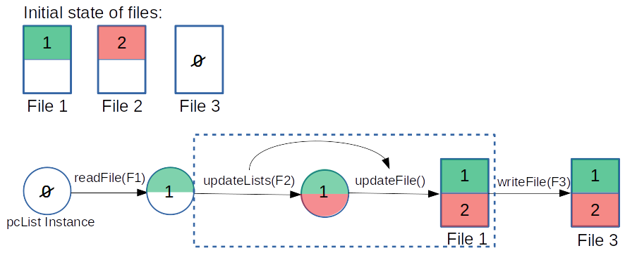

# Python Exam: Class postcardList

### Jesus Espinoza and Federico Barone

--------------------------------


For this exercise we were asked to implement a class that handles a list of postcards organized in different files.

The class should include specific member functions which its implementation can be explained with the following workflow example:



Initially we have three files:

* File 1 contains a list of postcards

* File 2 contains a different list of postcards

* File 3 is empty.

We create an instance of ```postcardList``` which is initially empty. The function ```readFile(F1)``` populates the object with the information of F1. Note that self._file = F1. ```updateLists(F2)``` updates the information stored in the object with the one contained in F2 and calls the ```updateFile()``` function to dump the new information in File 1 (the file associated with the object). Lastly, ```writeFile(F3)``` is used to dump the information stored in the object to a new file. The object is still associated with F1.  There are additional member functions that handle specific queries to the postcardList. More documentation is available in the documentation folder. We did it with ```Doxygen``` just to try it out.

There were a lot different implementations, we choose this as an example, trying to force consistency between the instance of the class and the file associated to it. 
